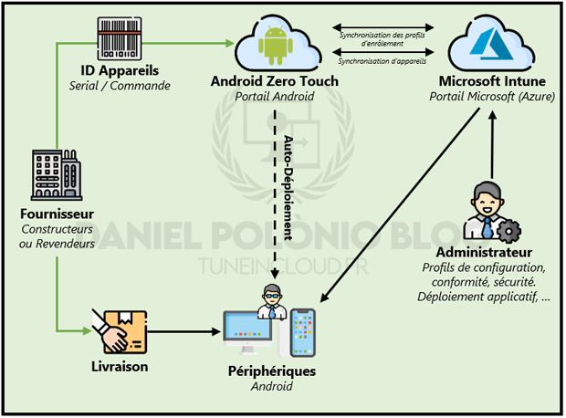

L'utilisation de Android Zero Touch Enrollment (ZTE) permet de mettre en place un scénario d'enrôlement automatique au déballage de l'appareil. À l'instar de Autopilot pour les périphériques Windows, ZTE permet aux appareils Android compatibles achetés par l'entreprise d'être préaffecté à un profil d'enrôlement Intune.

En lieu et place de scanner le QR code fourni par Intune, la préaffectation du profil dans la console Android Zero Touch permettra à l'appareil de se démarrer pour la première fois directement sur sa cinématique d'enrôlement professionnel sans aucune manipulation de l'utilisateur ou d'un administrateur.

<figure>

<figcaption>

Processus d'enrôlement automatique via Android Zero Touch Enrollment

</figcaption>

</figure>

"Android Zero Touch" est donc une solution d'enrôlement automatique tout comme "Samsung Knox Mobile Enrollment" (KME).

**Avantages de ZTE :** Couvre un large scope de périphériques Android. Depuis 2020, tous les appareils Android sont devenus compatibles ZTE. Si un appareil ne peut pas être intégré sur la console ZTE il s'agit d'une limitation du revendeur.

**Inconvénients de ZTE :** Pas de blocage de l'appareil si enrôlement professionnel non complété (par exemple : pas de connexion internet au déballage de l'appareil donc profil non appliqué).

<!--more-->

## I - Inscription à Android Zero Touch

Avant de commencer, il est nécessaire de créer un compte Android Zero Touch pour son entreprise.

L'inscription à ZTE ne peut pas être effectuée directement par l'entreprise, il est nécessaire de passer par un revendeur agréé afin de procéder à l'inscription. Ce revendeur servira de point d'entrée vers la console, mais une fois cette inscription validée : la console ZTE appartiendra à l'entreprise qui sera libre de travailler avec d'autres revendeurs.

Le lien vers le portail ZTE est le suivant : [https://partner.android.com/zerotouch](https://partner.android.com/zerotouch)

## II - Configuration de l'enrôlement automatique

Les périphériques sur lesquels un scénario d'enrôlement automatique est souhaité doivent impérativement être présents sur la console ZTE. Pour ce faire, il est nécessaire que ces **appareils soient ajoutés automatiquement par le revendeur**. En passant par le revendeur ayant permis la création du portail ou en indiquant un nouveau revendeur sur la console.

Les revendeurs ont la possibilité d'ajouter de manière automatique les périphériques achetés par leur biais. Aucune action d’administrateur n'est requise et aucun surcoût n'est à prévoir. Liste des revendeurs agréés pour Android Zero Touch : [https://androidenterprisepartners.withgoogle.com/resellers/](https://androidenterprisepartners.withgoogle.com/resellers/)

Attention, à l'inverse de Samsung Knox, il n'existe aucun moyen de contournement permettant d'ajouter manuellement et sans action d'un revendeur un appareil sur la console ZTE. Le processus d'achat est donc un élément indispensable à prendre en compte.

### A. Création du profil MDM Zero Touch

L’objectif est maintenant de récupérer les profils d’enrôlement créés dans Microsoft Intune afin de les affecter automatiquement aux appareils présent dans la console ZTE.

### B. Configuration d'Android Zero Touch directement dans Intune

Microsoft Intune et Android Zero Touch Enrollment proposent la possibilité de mettre en place un scénario d'inscription sans contact "en bloc" entièrement sur Intune. Il ne sera donc pas nécessaire de se connecter au portail ZTE pour associer les appareils à leur profil d'enrôlement Intune (comme présenté ci-dessus).

_**Attention**, l'inscription sans contact directement depuis Intune fonctionne uniquement avec les appareils Android professionnels enrôlés en mode COPE. Pour les périphériques COBO et COSU, l'affectation du profil à l'appareil se fera forcément sur la console ZTE._

### C. Affecter des profils d'inscription Intune aux périphériques dans ATE

Une fois les appareils présents dans la console et les profils d'inscription Intune liés, l'administrateur aura pour unique tâche d'associer le périphérique à son profil d'enrôlement souhaité. Pour ce faire :

1. Depuis la **console ZTE**, se rendre dans la liste des **appareils**

3. Dans la colonne **"Configuration"** choisir le **profil d'enrôlement souhaité** dans la liste déroulante.

## Articles Associés

Lien vers Article **"Inscription Android Entreprise"**

Lien vers Article **"Configurer l'enrôlement automatique avec Android Zero Touch"**
