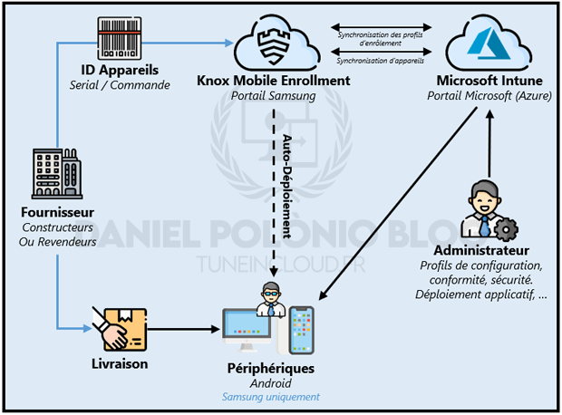

L'utilisation de Samsung Knox Mobile Enrollment (KME) permet de mettre en place un scénario d'enrôlement automatique au déballage de l'appareil. A l'instar de Autopilot pour les périphériques Windows, KME permet aux appareils Samsung (compatibles Knox) achetés par l'entreprise d'être pré affecté à un profil d'enrôlement Intune.

En lieu et place de scanner le QR code fourni par Intune, la pré affectation du profil dans la console Samsung Knox permettra à l'appareil de se démarrer pour la première fois directement sur sa cinématique d'enrôlement professionnel sans aucune manipulation de l'utilisateur ou d'un administrateur.

<figure>

<figcaption>

Processus d'enrôlement automatique via Samsung Knox Enrollment

</figcaption>

</figure>

"Samsung Knox Mobile Enrollment" est donc une solution d'enrôlement automatique tout comme "Android Zero Touch" (ZTE).

**Avantage de KME :** Si un appareil possède un profil d'entreprise affecté via KME, ce dernier se retrouvera bloqué s'il ne s'est pas enrôlé correctement (par exemple : pas de connexion internet au déballage de l'appareil donc profil non appliqué). Dès lors que le périphérique se connectera à internet, KME bloquera le téléphone en lui exigeant une réinitialisation.

**Inconvénients de KME :** Seuls les appareils Samsung (et compatibles Knox) peuvent être inscrits via ce scénario. Ce qui ne couvre qu'une partie de l'ensemble des périphériques Android existants.

<!--more-->

## I - Inscription à Samsung Knox

Avant de commencer, il est nécessaire de créer un compte Samsung Knox pour son entreprise. A l'inverse de Android Zero Touch, cette opération doit se faire directement par l'entreprise via le lien suivant : [https://www2.samsungknox.com/en/register](https://www2.samsungknox.com/en/register)

Il suffit de suivre les étapes et d'attendre la confirmation de Samsung _(cette confirmation peut prendre plusieurs jours)._

_**Problèmes connus :** Attention ne pas oublier de saisir tous les champs (Ville / Etat / Numéro de téléphone). Si l'ensemble des champs ne sont pas renseignés, vous pourrez rencontrer des problèmes lors de l'activation des comptes d'autres administrateurs._

## II - Configuration de l'enrôlement automatique

### Prérequis :

Les périphériques sur lesquels un scénario d'enrôlement automatique est souhaité doivent impérativement être présent sur la console KME. Pour ce faire, il existe deux façons :

1. **Appareils ajoutés automatiquement par le revendeur** - Solution à privilégier. En indiquant sur la console KME vos différents revendeurs, ces derniers ont la possibilité d'ajouter de manière automatique les périphériques achetés sur Knox Enrollment. Aucune action administrateur n'est requise et aucun surcout n'est à prévoir.

3. **Appareils ajoutés manuellement via l'application "Knox Deployment"** - Solution de contournement. Si certain appareils n'ont pas pu être intégrés de manière automatique il est possible de servir d'un périphérique Android d'administration qui servira d'interface entre la console KME et les autres périphériques à y intégrer. Pour ajouter des appareils via cette méthode il faut :
    - Télécharger Knox Deployment sur l'Android d'administration et s'y connecter avec un compte Samsung ayant des droits d'administration (attention il faut des droits spécifique pour Knox Deployment) dans la console KME.
    
    - Facultatif : Sélectionner le profil KME souhaité. Dans ce cas, le périphérique pourra lancer directement l'enrôlement automatique via KME. Sinon le périphérique sera intégré à la console et sera prêt à recevoir un profil ultérieurement via affectation administrateur.
    
    - Choisir le mode d'interface pour l'ajout de nouveaux périphériques entre : NFC, Bluetooth et Wi-Fi direct
    
    - Lancer le déploiement en choisissant la durée d'appairage souhaité entre 30 minutes et 8 heures.
    
    - Depuis le périphérique client maintenant (celui qui doit être ajouté à la console) lancer la synchronisation avec l'appareil d'administration. Le mode d'appairage va dépendre du mode d'interface choisi. Pour le NFC il suffira de rapprocher son téléphone, pour le Wi-Fi direct se connecté au réseau Wi-Fi créé pour l'occasion et pour le Bluetooth lancer l'URL : [https://me.samsungknox.com](https://me.samsungknox.com/) depuis un navigateur.

### A. Création du profil MDM Knox Enrollment

L'objectif est maintenant de récupérer les profils d'enrôlement créés dans Microsoft Intune afin de les affecter automatiquement aux appareils présent dans la console KME.

### B. Affecter des profils d'inscription Intune aux périphériques dans KME

Une fois les appareils présents dans la console et les profils d'inscription Intune liés, l'administrateur aura pour unique tâche d'associer le périphérique à son profil d'enrôlement souhaité. Pour ce faire :

1. Depuis la **console KME**, se rendre dans la liste des **appareils**

3. **Cocher** les cases des appareils souhaités et cliquer sur le bouton **Action** et sélectionner **"Configurer les appareils"**

5. Dans la partie **"Profil"** : Choisir le **profil d'enrôlement souhaité** dans la liste déroulante

7. Valider et cliquant sur le bouton **Enregistrer**.

## Articles Associés

Lien vers Article **"Inscription Android Entreprise"**

Lien vers Article **"Configurer l'enrôlement automatique avec Android Zero Touch"**
