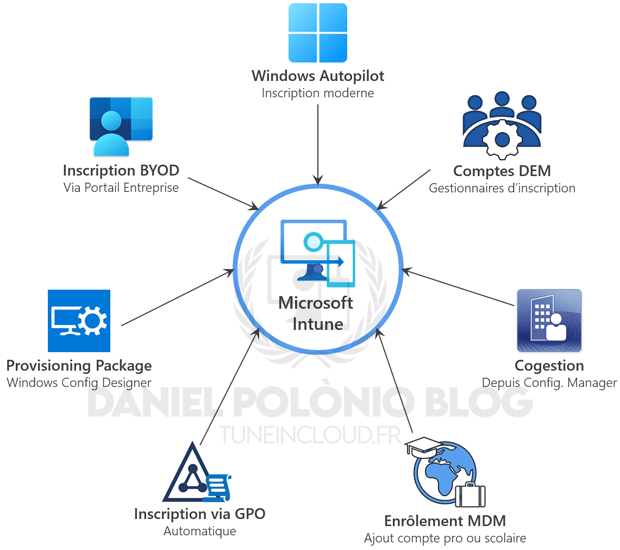
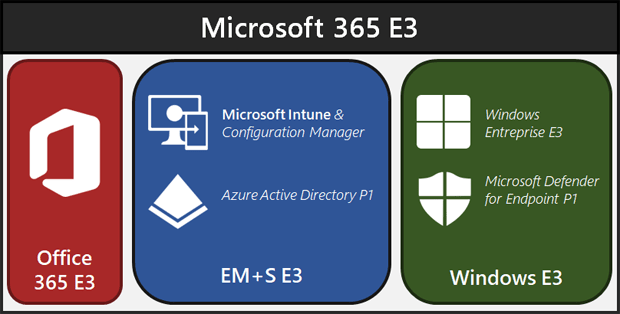
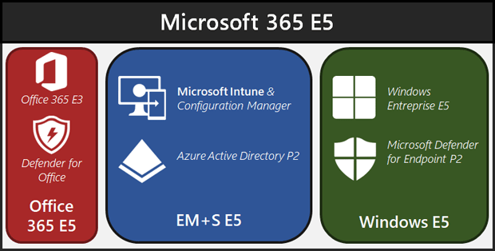
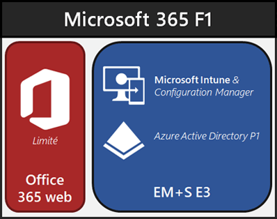
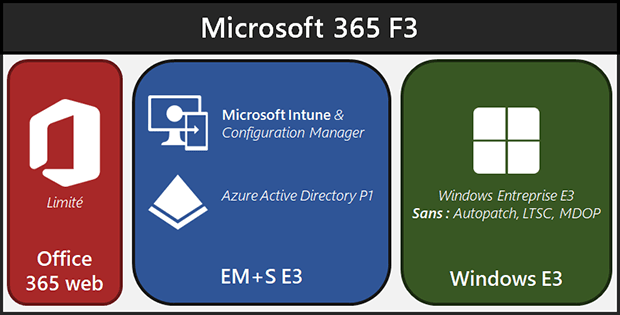
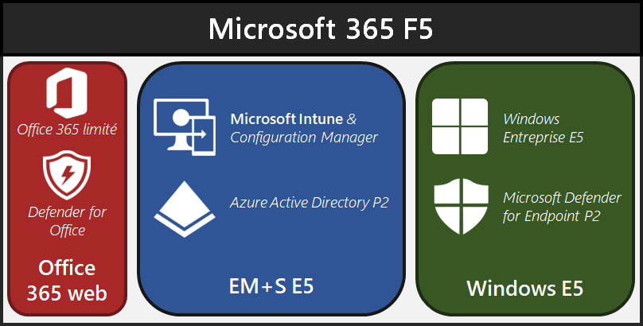
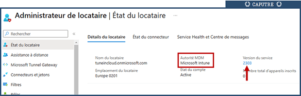
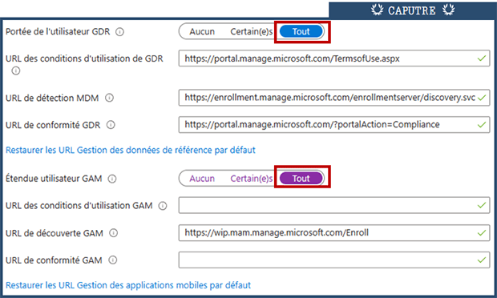

Microsoft Intune permet la gestion des terminaux sous Windows en mettant en avant une centralisation et une simplification de sa gestion de parc. En fonction de l'évolution des usages, Intune s'inscrit dans un nouveau modèle de gestion.  
Quand il y a encore 10ans, un terminal professionnel était un ordinateur physique dans un environnement d'entreprise fermé. Aujourd'hui, un utilisateur se connecte à des applications d'entreprise depuis tout un tas de périphériques (PC portables, smartphones, tablettes, Teams room, ...) mais également depuis n'importe où.

C'est donc dans une volonté de centraliser la gestion de tous ces usages "modernes" que Microsoft Intune a été conçu. Et même si la gestion des postes de travail existe depuis des années sur de nombreux outils, Intune apporte une simplification significative de la gestion. À commencer par l'inscription des périphériques via Windows Autopilot.

Cependant, même si Autopilot reste la solution à privilégier pour l'inscription moderne des périphériques dans Microsoft Intune, il ne s'agit pas de l'unique point d'entrée vers Intune.  
Cet article expliquera donc les différents chemins possibles afin d'inscrire les appareils Windows 10/11 sur Intune.

## I - Les méthodes d'inscription dans Microsoft Intune

Comme évoqué dans l'article : ["Modes de jonctions des appareils dans Azure AD"](https://tuneincloud.fr/2023/02/27/modes-de-jonctions-des-appareils-dans-azure-ad/), les appareils gérés par Microsoft Intune peuvent être en mode "Full Cloud" ou en mode "Hybride". Mais quoi qu'il en soit, ils ont une gestion cloud via un service SaaS.

Ce qui signifie que le seul prérequis à un enrôlement Intune est une connexion à internet. Dans le schéma ci-dessous, vous trouverez l'ensemble des méthodes d'enrôlement possibles pour des périphériques Windows :

<!--more-->

Afin d'en savoir plus sur l'ensemble de ces méthodes d'enrôlement, vous trouverez ci-après la liste des articles dédiés :

- [Inscription via Windows Autopilot](https://tuneincloud.fr/2023/03/24/i/)

- Inscription via Portail Entreprise par l'utilisateur - _en cours de rédaction_

- Inscription automatique via GPO - _en cours de rédaction_

- Inscription via Comptes DEM - _en cours de rédaction_

- Inscription groupée via Provisioning Package - _en cours de rédaction_

- Mise en place de la cogestion - _en cours de rédaction_

- Enrôlement MDM par l'utilisateur - _en cours de rédaction_

* * *

## II - Configuration du tenant

### A. Prérequis : Licences Microsoft

Le service Microsoft Intune est inclus dans le plan de licence EM+S (comprenant Intune et Azure Active Directory Premium).

Il est donc possible de souscrire à Intune en s'abonnant à des plans de licences EM+S E3 ou EM+S E5. Cependant d'autres packages de licences incluent la partie EM+S :

- Microsoft 365 E3

- Microsoft 365 E5

- Microsoft 365 F1

- Microsoft 365 F3

- Microsoft 365 F5

- Microsoft 365 Business Premium

_Schémas simplifiés des plans de licences comprenant EM+S :_

Les schémas présentés ci-dessus sont simplifiés afin de comprendre la construction de chaque package. Afin de _connaître en détail les produits de chaque package, rendez-vous sur le site [Microsoft 365 Maps](https://m365maps.com/)._

Il est également possible de souscrire à Intune via des licences "Intune for device only". Ces licences doivent être souscrites pour les appareils sans affectation utilisateurs (type kiosque). Ces licences ne s'affectent pas directement aux appareils, elles sont uniquement déclaratives et doivent représenter le nombre d'appareils sans affinité utilisateur. _Étant donné qu'il n'y a pas d'affinité utilisateur sur ces appareils, certains services ne sont pas accessibles tels que : Accès conditionnels, Stratégies de protection d'applications et toutes les configurations basées sur les utilisateurs._

* * *

### B. Configurations préalables

#### 1\. Vérification de l'autorité MDM

Par défaut, Intune est l'autorité MDM lors de la création d'un tenant Microsoft 365. Afin de vérifier l'autorité MDM :

1. Se connecter au [Portail Intune](https://endpoint.microsoft.com/)

3. Se rendre dans la partie "Administrateur de Locataire"

5. Dans la partie "État du Locataire" vérifiez l'Autorité MDM

#### 2\. Activer l'inscription automatique dans Microsoft Intune

Comme vu dans l'article "[Modes de jonctions des appareils dans Azure AD](https://tuneincloud.fr/2023/02/27/modes-de-jonctions-des-appareils-dans-azure-ad/)", c'est le service Azure Active Directory qui fait office de référentiel sur l'inscription des périphériques. Afin de s'assurer que chaque périphérique opérant une jonction AAD conforme puisse s'inscrire automatiquement dans Microsoft Intune, il est nécessaire de configurer l'inscription automatique des appareils.

Afin d'activer l'inscription Automatique il suffit de :

1. Se connecter au [Portail Azure Active Directory](https://portal.azure.com/)

3. Se rendre dans la partie "Mobilité (gestion des données de référence et gestion des applications mobiles)"

5. Cliquer sur le service "Microsoft Intune"

7. Configurer la "Portée de l'utilisateur GDR" & "Étendue utilisateur GAM" sur TOUT.

Il est possible de _limiter l'inscription Intune à des groupes d'appareils, mais d'un point de vue personnel je ne fais jamais ça. Certains problèmes d'enrôlement peuvent apparaître en sélectionnant des groupes spécifiques à cet endroit. Afin de filtrer correctement les périphériques qui peuvent s'inscrire dans Intune, je priorise la partie "Restriction d'inscription" (ci-après)_

Et c'est terminé ! Intune n'a pas besoin de configurations supplémentaires pour être opérationnel.

#### BONUS #1. Activer des droits Intune à vos administrateurs.

Afin de permettre à vos administrateurs d'avoir des droits sur la console Intune, il existe un rôle Azure dédié intitulé "Administrateur Intune". Afin d'affecter ce rôle, il est nécessaire de :

1. Se connecter au [Portail Azure Active Directory](https://portal.azure.com/)

3. Se rendre dans la partie "Rôles et administrateurs"

5. Rechercher le rôle "Administrateur Intune" et cliquer dessus

7. Cliquer sur "Ajouter des attributions", sélectionner votre administrateur et valider

Il est également possible de faire hériter le rôle d'administration à un groupe Azure Active Directory :

1. Se connecter au [Portail Azure Active Directory](https://portal.azure.com/)

3. Se rendre dans la partie "Groupes"

5. Sélectionner le groupe en question

7. Se rendre dans "Rôles et administrateurs" et ajouter le rôle "Administrateur Intune" au groupe

Bien évidemment, le rôle "Administrateur Général" bénéficiera de toutes les _autorisations sur Intune comme pour l'ensemble des autres portails d'administration M365._

Nous parlerons dans un prochain article de la mise en place d'un modèle de délégation d’administrateur spécifique à Intune permettant de donner les bons droits sur les bons périmètres à différents rôles d’administrateurs.

#### BONUS #2. Créer des groupes dynamiques pour vos configurations "socles" Intune

Un des grands sujets dans la mise en place de Microsoft Intune est la partie affectation des stratégies. Cet article n'a pas pour vocation de parler des bonnes pratiques d'affectation, mais de proposer deux groupes dynamiques récupérant automatiquement : l'ensemble des utilisateurs avec une licence EMS et l'ensemble des appareils Windows inscrits dans Intune.  
Ces groupes pourront servir d'une première base pour l'affectation des stratégies du socle technique.

1. Se connecter au [Portail Azure Active Directory](https://portal.azure.com/)

3. Se rendre dans la partie "Groupes"

5. Cliquer sur "Nouveau Groupe"

7. Renseigner le nom du groupe

**Groupe Dynamique : Tous utilisateurs Intune**

5\. Sélectionner dans "type d'appartenance" : Utilisateur dynamique

6\. Copier la requête dynamique suivante :

`(user.assignedPlans -any assignedPlan.service -startsWith "SCO" -and assignedPlan.capabilityStatus -eq "Enabled")`

**Groupe Dynamique : Tous appareils Windows Intune**

5\. Sélectionner dans "type d'appartenance" : Appareil dynamique

6\. Copier la requête dynamique suivante :

`(device.deviceOSType -contains "Windows") and (device.managementType -eq "MDM")`

Valider la création du groupe.

* * *

## III - Restrictions d'inscription :

Comme évoqué ci-dessus, par défaut sur Intune l'ensemble des types d'inscription sont ouverts. S'il est nécessaire de créer une configuration pour l'ensemble des scénarios d'enrôlement d’entreprise, les scénarios d'enrôlement BYOD sont eux complètement ouverts : qu'un socle technique soit mis en place ou pas.

Bon nombre d'entreprises se retrouvent donc avec une multitude d'appareils personnels inscrits sur Intune avant même d'avoir souhaité proposer une gestion BYOD.

S'il est conseillé de ne pas filtrer l'inscription automatique via la configuration "Mobilité (gestion des données de référence et gestion des applications mobiles)", il est indispensable de s'assurer que les règles de restrictions Intune soient conformes aux exigences de l'entreprise dès l'activation du service.

Il existe deux possibilités de restrictions d'inscription sur Intune :

1. Le nombre d'appareils qu'un utilisateur peut inscrire

3. Les types d'appareils qu'un utilisateur peut inscrire

### A. Restriction du nombre d'appareils

* * *

### B. Restriction du type d'appareil

C'est la partie la plus importante, trop souvent ignorée, qui permettra d'éviter la pollution de Microsoft Intune par des périphériques non désirés.

C'est de cette façon que vous allez notamment pouvoir autoriser l'inscription BYOD pour des groupes d'utilisateurs spécifiques.

* * *

## Articles Associés

Lien vers Article **"Modes de jonctions des appareils dans Azure AD"**

**Lien vers Article "Inscription avec Windows Autopilot"**

Lien vers Article **"**Inscription via Portail Entreprise par l'utilisateur" - _en cours de rédaction_

Lien vers Article **"**Inscription automatique via GPO" - _en cours de rédaction_

Lien vers Article **"**Inscription via Comptes DEM" - _en cours de rédaction_

Lien vers Article **"**Inscription groupée via Provisioning Package" - _en cours de rédaction_

Lien vers Article **"**Mise en place de la cogestion" - _en cours de rédaction_

Lien vers Article **"**Enrôlement MDM par l'utilisateur" - _en cours de rédaction_
