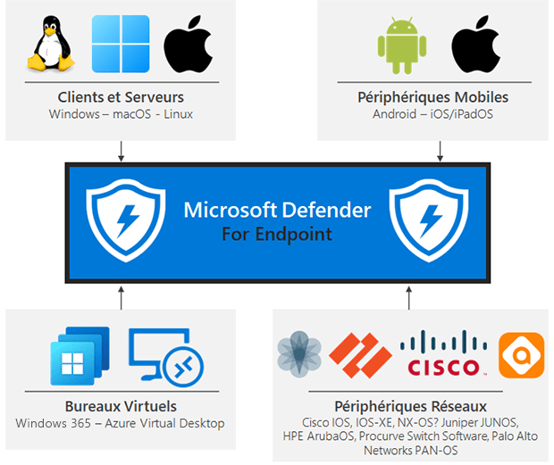
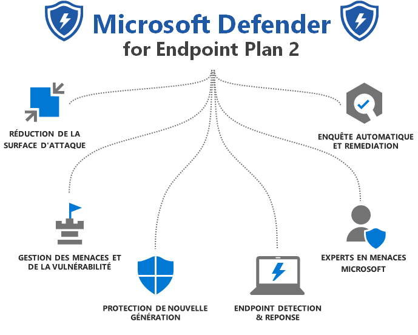
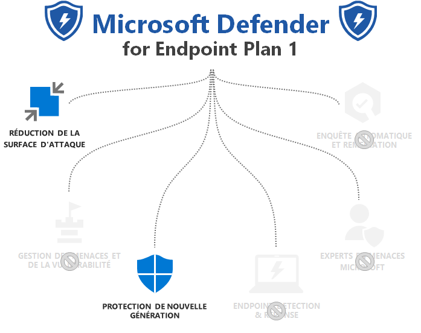
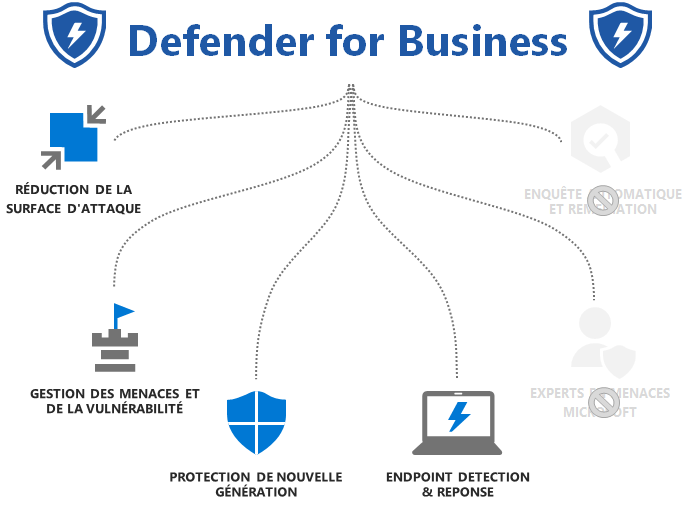
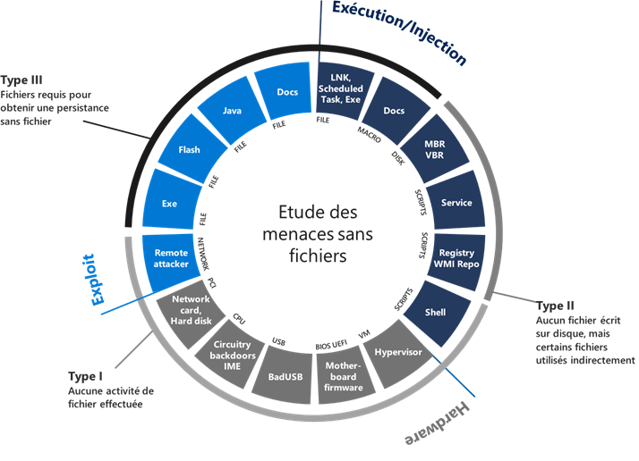

Microsoft Defender for Endpoint est une solution fournissant un centre d'opérations pour la sécurisation centralisée de différentes plateformes, à savoir :

Microsoft Defender for Endpoint (MDE) est une solution complète pour prévenir, détecter et automatiser l'investigation et la réponse aux menaces contre les périphériques d'entreprise. MDE est donc un regroupement de plusieurs services non uniquement une solution EDR comme on peut l'entendre parfois.

Il fait parti intégrante de **Microsoft 365 Defender** et partage donc toutes ses données de télémétrie sur le "Security Center" auprès des autres produits composant Microsoft 365 Defender :

- Microsoft Defender for Endpoint (MDE)

- Microsoft Defender for Office365 (MDO)

- Microsoft Defender for Cloud Apps (MDA)

- Microsoft Defender for Identity (MDI)

- Azure AD Identity Protection (AADIP)

Il existe trois plans de licences pouvant inclure les produits Microsoft Defender for Endpoint :

- Microsoft Defender for Endpoint Plan 2 (MDE P2)

- Microsoft Defender for Endpoint Plan 1 (MDE P1)

- Defender for Business

Voici le détail de chacun de ces plans de licences :

_\*Inclus dans les plans de licence Microsoft 365 E5 (ou Microsoft 365 E5 Security)_

<!--more-->

_\*Inclus dans les plans de licence Microsoft 365 E3_

_\*Inclus dans les plans de licence Microsoft Business Premium_

* * *

## 1 - Gestion des menaces et des vulnérabilités (TVM)

La gestion des menaces et vulnérabilités (TVM) permet d'avoir une cartographie complète des menaces pesant sur les périphériques d'entreprise basé sur des données remontées par le capteur MDE recoupés avec les menaces réelles. Elle permet notamment d'alimenter l'une des métriques les plus importante du Security Center : le **Score d'Exposition**. Ce dernier doit être suivis par les équipes sécurité afin de piloter afin de connaitre son niveau d'exposition et mener les actions de corrections dans le but de diminuer un maximum ce score. TVM permet en autres de hiérarchiser les vulnérabilités en fonction de leur criticité et du nombre de périphériques sous menace.

La gestion des menaces et vulnérabilités de décompose en trois temps :

1. **La découverte en continue :  
    **Le capteur MDE évaluera en temps réel et en continue les **vulnérabilités** de manière approfondie. Il détectera les vulnérabilités :  
    \- Matérielles (firmware). _Exemple : Spectre/Meltdown_  
    \- Du noyau du système d'exploitation. _Exemple : élévation de privilège Win32_  
    \- Des applications (first/third party). _Exemple : 7-zip code execution_  
    \- Des bibliothèques d'exécution d'applications. _Exemple : Vulnérabilité Framework_  
    \- Des extension d'applications. _Exemple : Extension Chrome Grammarly_  
      
    La découverte ne s'arrête pas à la détection des vulnérabilité mais peut également évaluer les **mauvaises configuration**s de sécurité réalisés par les administrateurs :  
    \- Mauvaise configuration du système d'exploitation : _analyse du partage de fichiers, configuration de la pile de sécurité, base de référence du système d'exploitation_  
    \- Mauvaise configuration de l'application : _principe du moindre privilège, analyse Client/Serveur/Application Web, évaluation du certificat SSL/TLS_  
    \- Mauvaise configuration du compte : _politique de mot de passe, analyse des autorisations_  
    \- Mauvaise configuration du réseau : _analyse des ports ouverts, analyse des services réseau_  
      
    

3. **Hiérarchisation des menaces :  
    **Une fois la découverte effectuée, TVM priorise les menaces et les activités via le processus "TVL" (**T**hreat Landscape / Breach **L**ikelihood / Business **V**alue). Cette étape aide les administrateurs à se concentrer en priorité sur les bonnes actions à réaliser au bout moment. Les opérations T, V et L sont réalisées de manières cycle sur l'ensemble des données qui remontent de la phase découverte et permettent de définir le **score d'exposition** pour les menaces.  
      
    **T : Paysage des menaces** \- notes les caractéristiques de vulnérabilités (score CVSS et nombre de jours vulnérable) et les caractéristique d'exploit (public exploit & bundle). Il récupère également les alertes de sécurités remonté par l'EDR.  
      
    **L : Probabilité d'infraction** - évalue les probabilités de pénétration dans le système en prenant en compte les données Internet, les tentatives d'intrusion et le nombre de périphériques impliqués. Cette étape évalue également les stratégies de sécurité existante afin d'affiner la probabilité.  
      
    **V : Valeur commerciale** - réalise une estimation financière dans le cas où la menace aboutirait à une intrusion dans le système. Analyse HVA (WIP, HVU, processus critique) et analyse d'exécution et de dépendance  
      
    

5. **Le processus de correction de bout en bout :**  
    Cette étape consiste à faire le pont entre les administrateurs informations qui font le run et les équipes sécurité :
    - Demandes de correction en un clic via Intune ou Configuration Manager
    
    - Surveillance automatisée des tâches via l'analyse de l'exécution
    
    - Suivi des KPI de délai moyen d'atténuation
    
    - Riche expérience d'exception pour atténuer/accepter les risques
    
    - Intégration de la gestion des tickets (Intune, Planner, Service Now, JIRA)

* * *

## 2 - Réduction de la surface d'attaque (ASR)

La réduction de la surface d'attaque (ASR) consiste en la mise en place de stratégies Defender pour les appareils visant à limité au maximum les chemins d'actions d'un attaquant sur l'appareil. Etant donné que la surface d'attaque est réduite, les risques le deviennent également. Il s'agit donc de règles de durcissements du système qui doivent donc s'adapter à l'entreprise afin de mieux résister aux attaques.

Ces règles agissent sur les éléments suivants :

- Isolation basée sur le matériel

- Contrôle des applications

- Protection contre les exploits

- Protection du réseau

- Accès contrôlé aux dossiers

- Contrôle de l'appareil

- Protection Internet

- Protection contre les rançongiciels

- Isoler l'accès aux sites non fiables

- Isoler l'accès aux fichiers Office non approuvés

- Prévention des intrusions sur l'hôte

- Atténuation des exploits

- Protection contre les rançongiciels pour vos fichiers

- Bloquer le trafic vers des destinations de mauvaise réputation

- Protégez vos applications héritées

- Autoriser uniquement les applications de confiance à s'exécuter

Quelques exemples de règles de réduction de surface d'attaque :

1. **Règles des applications de productivité :**
    - Empêcher les applications Office de créer du contenu exécutable
    
    - Empêcher les applications Office de créer des processus enfants
    
    - Empêcher les applications Office d'injecter du code dans d'autres processus
    
    - Bloquer les appels d'API Win32 à partir de macros Office
    
    - Empêcher Adobe Reader de créer des processus enfants

3. **Règles email :**
    - Bloquer le contenu exécutable du client de messagerie et du webmail
    
    - Empêcher uniquement les applications de communication Office de créer des processus enfants

5. **Règles de scripts :**
    - Bloquer le code JS/VBS/PS/macro masqué
    
    - Empêcher JS/VBS de lancer le contenu exécutable téléchargé

7. **Menaces polymorphes :**
    - Bloquer l'exécution des fichiers exécutables à moins qu'ils ne répondent à un critère de prévalence, d'âge ou de liste de confiance
    
    - Bloquer les processus non approuvés et non signés qui s'exécutent à partir d'USB
    
    - Utilisez une protection avancée contre les ransomwares

9. **Déplacement latéral et vol d'identifiants :**
    - Bloquer les créations de processus provenant des commandes PSExec et WMI
    
    - Bloquer le vol d'informations d'identification du sous-système de l'autorité de sécurité locale de Windows
    
    - Bloquer la persistance via l'abonnement aux événements WMI

En somme, l'ASR est l'une des bonnes façon de pouvoir traiter : les failles "zero days", l'érosion des réseaux informatiques avec les publications d'applications / usages cloud, l'hétérogénéité du parcs informatiques.

* * *

## 3 - Protection nouvelle génération ( NGP)

La protection de nouvelle génération (NGP) est la partie antivirus de Defender for Endpoint. Il ne se concentre pas uniquement sur la protection traditionnelle basée sur les signatures. La protection de nouvelle génération se concentre fortement sur la protection basée sur le cloud/l'apprentissage automatique, la recherche approfondie des menaces et l'analyse des mégadonnées. La protection fournie par le cloud, la surveillance du comportement (comportement d'exécution) et la collaboration avec EDR sont intégrées nativement.

Afin de se protéger contre les menaces/malware sophistiqués, il se concentre sur le comportement d'exécution (analyse de la mémoire, interface AMSI, analyse de lignes de commande, ...). Lorsque le client rencontre des menaces inconnues, il envoie les métadonnées ou le fichier lui-même au service de protection cloud, où des protections plus avancées examinent les nouvelles menaces à la volée (durant 12 mois) et intègrent les signaux provenant de plusieurs sources.

Il existes deux types de fonctionnalités de protection dans Microsoft Defender for Endpoint NGP :

1. **Protection basée sur le cloud**
    - **Métadonnées** – classification des fichiers suspects par comparaison sur des modèles spécifiques.
    
    - **Comportement** – analyse du comportement de l'arborescence des processus cloud en temps réel. Surveillance de toute la chaine : faille, élévation, persistance, mouvements latéraux.
    
    - **AMSI** – analyse des comportements des scripts avant et après l'exécution (PowerShell, JavaScript, VBScript, VBA, ...)
    
    - **Classification de fichiers** – analyse des comportements de fichiers suspects et classification en temps réel pour autoriser ou bloquer le fichier très rapidement.
    
    - **Détonation** – détonation d'un fichier suspect dans une sandbox afin d'analyser les comportements observés et mieux comprendre l'attaque afin de la bloquer.
    
    - **Réputation** \- Interrogation des URL, mail, domaines, fichiers suspects via réputation (modèles SmartScreen et Defender for Office)

3. **Protection basée sur le client**
    - **Moteur ML** - Un ensemble de modèles d’apprentissage automatique légers pour verdict en quelques microsecondes. Incluent des modèles et des fonctionnalités spécialisés conçus pour des types de fichiers spécifiques couramment utilisés par les attaquants.
    
    - **Surveillance des comportements** – Observe les comportements des processus, y compris la séquence de comportements au moment de l'exécution, pour identifier et bloquer certains types d'activités en fonction de règles prédéterminées.
    
    - **Analyse de la mémoire** – Ce moteur analyse l'espace mémoire utilisé par un processus en cours d'exécution pour révéler les comportements malveillants qui peuvent se cacher grâce à l'obscurcissement du code.
    
    - **AMSI** – Le moteur d'intégration approfondie dans l'application permet la détection des attaques sans fichier et en mémoire. Cette intégration bloque le comportement malveillant des scripts côté client.
    
    - **Emulation** – Le moteur d'émulation décompresse dynamiquement les logiciels malveillants et examine leur comportement au moment de l'exécution.

Ces protections sont encore amplifiées grâce à **Microsoft Threat Protection** qui utilise un partage de signaux et orchestre des mesures correctives à travers les technologies de sécurité de Microsoft. Le moteur Microsoft Threat Protection sécurise les identités, les points de terminaison, les e-mails et les données, les applications et l’infrastructure.

* * *

## Détection et réponse des terminaux (EDR)

La brique EDR fait également partie de la solution Microsoft Defender for Endpoint. Elle permet de sécuriser les postes et les utilisateurs contres les attaques avancées avec des mécanismes de détection/enquête persistantes sur les attaques nouvelles générations.

Le mécanisme de EDR de MDE se base sur trois axes :

- La remontée de nombreuses alertes mis en corrélation automatiquement et en temps réel

- La chasse et l'investigation sur les menaces sur un total de 6 mois de données

- Un riche ensemble d'action automatique ou de proposition d'action à mettre en œuvre pour diminuer le niveau d'exposition des appareils.

L'analyse des différentes menaces permet de comprendre ce qui remonte en alerte en enquêtant sur toute l'activité de l'appareil.

Une fois l'analyse effectué, l'EDR va reconstruire l'histoire de l'attaque en décrivant les éventuelles activités associées. Tout en mettant en avant la porté de l'attaque afin d'être en capacité de réagir le plus rapidement possible.

* * *

## Enquête automatique et remédiation

L'enquête automatique et remédiation permet d'automatiser les actions que peuvent faire un analyse en cybersécurité. De la même manière que le ferais un humain.

L'objectif de MDE Auto IR n'est donc pas d'isoler automatiquement une machine qui remonte une alerte de sécurité. Il a pour objectif d'imiter les étapes idéales qu'un humain suivrait pour enquêter sur les alertes.

Les étapes réalisées par un analyse et reprise dans le processus MDE Auto IR sont :

1. Déterminer si la menace nécessite une action

3. Réaliser les actions correctives nécessaires

5. Décider quelles devraient être les prochaines enquêtes supplémentaires

7. Répéter cette opération autant de fois que nécessaire pour chaque alerte

L'objectif étant d'avoir une approche plus classique ayant porté ses fruits mais avec une meilleure réactivité et fonctionnant 7j/7 24h/24.

* * *

## Experts en menaces Microsoft

Le plan de licence MDE peut également inclure un support spécifique de Microsoft sur la cybersécurité. Ce support peut apporter à votre SOC des connaissances spécifiques et participent à la chasse proactives des menaces.

Ces experts en menaces Microsoft recherchent de manière proactive les anomalies ou les comportements malveillants connus dans votre environnement unique. Mais peuvent également être consultés à la demande via vos équipes sécurité.
