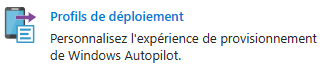
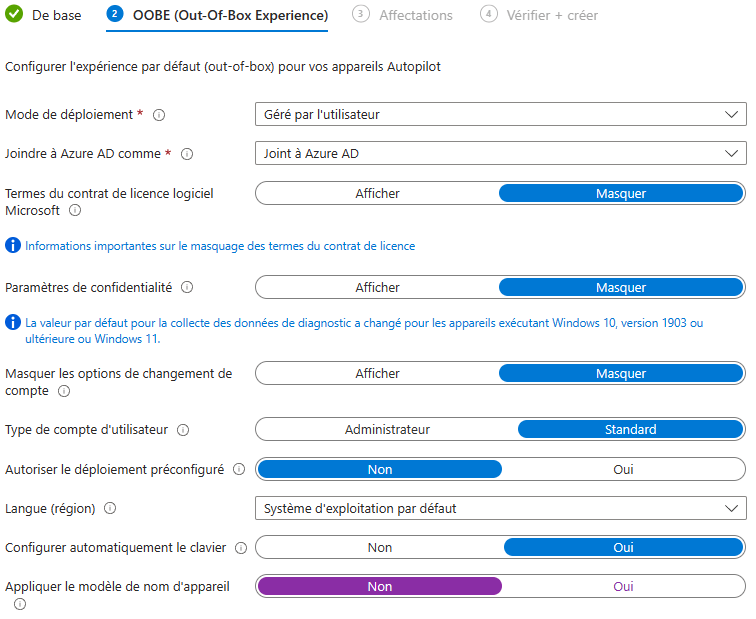

blabla bla

Voir l'article Autopilot de base...

répond aux scénarios A & D de l'article

## I - Prérequis

Licences

Etendue MDM

## II- Création du profil d'enrôlement

Blabla bla

### A. Mode "User Driven"

Le mode "user driven" est un scénario d'enrôlement dans lequel le poste est envoyé directement à l'utilisateur sans passer par l'IT. C'est donc l'utilisateur qui va déballer l'ordinateur, renseigner ses identifiants d'entreprise et se laisser porter par le processus d'inscription automatique _(plus de détail dans l'article de présent de Windows Autopilot ci-dessus)_.

**1-**

Se connecter au portail **[Microsoft Intune](https://endpoint.microsoft.com/)**

**2-**

Se rendre sur la partie "**Inscription Windows**" _(Via "Appareils > Windows" ou via "Inscrire des appareils")_. Cliquez sur le bouton **"Profils de déploiement"**.

**3-**

Cliquer sur le bouton **"+ Créer un profil"** et choisir : PC Windows.

Renseigner le **Nom** du profil d'enrôlement COPE ainsi qu'une **Description** (Facultatif)

Définir "Convertir tous les appareils ciblés en Autopilot" sur **Non.**

Cliquer sur **"Suivant"**

**4-**

Configurez la partie **OOBE** comme suivant :

Valeurs que vous pouvez adapter en fonction de votre contexte :

**\- Type de compte utilisateur :** Si vous souhaitez que l'utilisateur effectuant l'enrôlement devienne administrateur du poste  
**\- Langue (région) :** Si vous souhaitez définir une langue différente de celle du système d'exploitation OEM acheté  
**\- Appliquer le modèle de nom d'appareil :** Si vous souhaitez mettre en place une convention de nommage des postes. Exemple : PC-%SERIAL%

Cliquer sur **"Suivant"**

**5-**

Dans la partie Affectations, sélectionner un groupe d'appareils Autopilot (créé ci-dessus). Valider en cliquant sur "**Suivant"**

**6-**

Vérifier l'ensemble des paramètres, et valider la création du profil d'enrôlement Autopilot en cliquant sur **"Créer"**.

### B. Mode "Pré-Provisioning"

Le mode "Pré-Provisioning" (anciennement White Glove) est un scénario d'enrôlement dans lequel le poste est envoyé à des techniciens. En fonction des affectations de profil/utilisateur sur le poste Autopilot, ce dernier recupérera les stratégies qui lui sont appliquées sans avoir besoin de renseigner les identifiants du compte utilisateurs. Le poste sera envoyé dans un second à l'utilisateur qui aura un processus d'enrôlement plus rapide qu'en mode "user-driven" _(plus de détail dans l'article de présent de Windows Autopilot ci-dessus)_.

## III - Affecter le profil Autopilot

Balise de groupe

Pré-affectation

## IV - Expérience utilisateur

Elle est façonnée par deux éléments :

1. Le scénario d'enrôle (A ou D)

3. La configuration de l'ESP (voir article sur l'ESP)

Quel expérience utilisateur pour ici  
...
